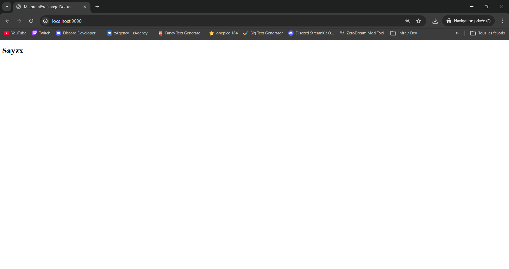
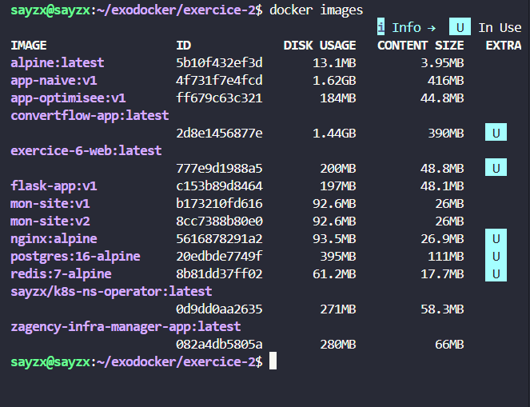
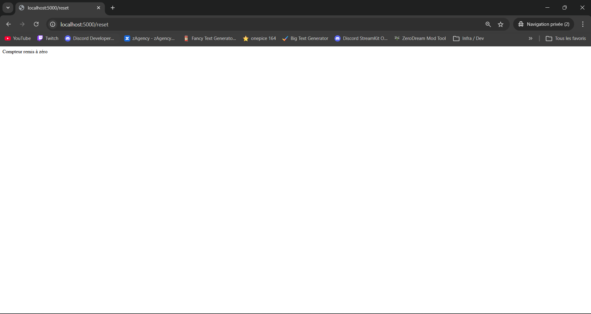

# 🐳 TP Docker — Réponses

**Formation pratique Docker** | Niveau Débutant → Challenge  
**Prérequis :** `docker --version` · `docker compose version`

> [!IMPORTANT]
> Ce README a été généré avec l’aide d’une IA afin d’obtenir une mise en forme claire, lisible et soignée.  
> Le contenu technique a été **vérifié et relu manuellement**, et les **captures d’écran ont été ajoutées à la main**.

---

## Partie 1 — Les bases

---

### Exercice 1 — Premier contact avec Docker

**1.1** Télécharger l'image sans lancer de conteneur :
```bash
docker pull nginx:alpine
```

**1.2** Lancer le conteneur en arrière-plan sur le port 8080 :
```bash
docker run -d --name mon-nginx -p 8080:80 nginx:alpine
```

**1.3** Lister uniquement les conteneurs en cours d'exécution :
```bash
docker ps
```

**1.4** Résultat de `curl http://localhost:8080` ou dans le navigateur :

> La page d'accueil par défaut de Nginx s'affiche : *"Welcome to nginx!"*


**1.5** Afficher les logs :
```bash
docker logs mon-nginx
```

**1.6** Arrêter le conteneur et lister tous les conteneurs (y compris arrêtés) :
```bash
docker stop mon-nginx
docker ps -a
```

> **Différence avec 1.3 :** `docker ps` n'affiche que les conteneurs dont le statut est `Up`. `docker ps -a` (ou `--all`) affiche **tous** les conteneurs, y compris ceux avec le statut `Exited`.

**1.7** Supprimer le conteneur et vérifier :
```bash
docker rm mon-nginx
docker ps -a
```
> Le conteneur n'apparaît plus dans la liste.

**1.8** Lancer un conteneur qui se supprime automatiquement à l'arrêt :
```bash
docker run -d --rm --name mon-nginx -p 8080:80 nginx:alpine
```
> Le flag `--rm` supprime automatiquement le conteneur dès qu'il s'arrête.

---

### Exercice 2 — Construire sa première image avec un Dockerfile

**Structure du dossier :**
```
exercice-2/
├── Dockerfile
└── index.html
```a

**2.1** Contenu de `index.html` :
```html
<!DOCTYPE html>
<html lang="fr">
<head>
    <meta charset="UTF-8">
    <title>Ma première image Docker</title>
</head>
<body>
    <h1>Prénom</h1>
</body>
</html>
```

**2.2** Contenu du `Dockerfile` :
```dockerfile
FROM nginx:alpine
COPY index.html /usr/share/nginx/html/index.html
EXPOSE 80
```

**2.3** Construire l'image avec le tag `mon-site:v1` :
```bash
docker build -t mon-site:v1 .
```

**2.4** Lancer le conteneur sur le port 9090 :
```bash
docker run --rm -p 9090:80 mon-site:v1
```



**2.5** Lister les images locales :
```bash
docker images
```
> `mon-site:v1` est légèrement plus lourde que `nginx:alpine` (quelques Ko de plus) car elle n'ajoute qu'un fichier HTML.




**2.6** Inspecter les layers :
```bash
docker history mon-site:v1
```
> **2 layers** ont été ajoutés par rapport à l'image de base : un pour `COPY` et un pour `EXPOSE`.

**2.7** Modifier `index.html`, reconstruire en `v2` :
```bash
docker build -t mon-site:v2 .
```
> - **Rechargé depuis le cache :** `FROM nginx:alpine` (layer de base inchangé)  
> - **Réexécuté :** `COPY index.html ...` (fichier modifié → cache invalidé) et toutes les instructions suivantes

**2.8** Supprimer uniquement `v1` :
```bash
docker rmi mon-site:v1
```

---

### Exercice 3 — Volumes et persistance des données

**3.1** Test du caractère éphémère du système de fichiers :
```bash
docker run -it --rm alpine sh
# Dans le conteneur :
mkdir /data && echo "bonjour" > /data/test.txt && exit

docker run -it --rm alpine sh
# Dans le nouveau conteneur :
cat /data/test.txt  # → Erreur : fichier introuvable
```
> **Explication :** Chaque conteneur dispose de son propre système de fichiers isolé. À l'arrêt, toutes les données écrites dans le conteneur sont perdues. Les deux lancements créent des instances indépendantes.

**3.2** Bind mount avec Nginx :
```bash
mkdir -p exercice-3/html
echo "<h1>Hello depuis l'hôte</h1>" > exercice-3/html/index.html
docker run -d --rm -p 8080:80 -v $(pwd)/exercice-3/html:/usr/share/nginx/html nginx:alpine
```
> Après modification de `index.html` sur la machine hôte et rafraîchissement du navigateur : **le changement s'affiche immédiatement**, sans redémarrer le conteneur. Le bind mount est un lien direct vers le dossier de l'hôte.

**3.3** Créer un volume nommé :
```bash
docker volume create mes-donnees
```

**3.4** Écrire dans le volume :
```bash
docker run -it --rm -v mes-donnees:/data alpine sh
# Dans le conteneur :
echo "je survis" > /data/persistant.txt && exit
```

**3.5** Relire depuis un nouveau conteneur :
```bash
docker run -it --rm -v mes-donnees:/data alpine sh
# Dans le conteneur :
cat /data/persistant.txt  # → "je survis" 
```
> **Démonstration :** Les données écrites dans un volume nommé persistent indépendamment du cycle de vie des conteneurs. Un volume est géré par Docker et n'est pas lié à un conteneur spécifique.

**3.6** Lister les volumes :
```bash
docker volume ls
docker volume inspect mes-donnees
```
> Docker stocke physiquement les volumes dans : `/var/lib/docker/volumes/mes-donnees/_data`

**3.7** Supprimer le volume :
```bash
docker volume rm mes-donnees
```
> ⚠️ **Précaution :** S'assurer qu'**aucun conteneur n'utilise le volume** avant de le supprimer (`docker ps -a`). La suppression est irréversible — toutes les données sont définitivement perdues.

---

### Exercice 4 — Réseaux Docker

**4.1** Lister les réseaux existants :
```bash
docker network ls
```
> Les **trois réseaux créés par défaut** sont : `bridge`, `host`, `none`

**4.2** Créer un réseau bridge personnalisé :
```bash
docker network create mon-reseau
```

**4.3** Lancer le serveur web sur ce réseau :
```bash
docker run -d --name serveur-web --network mon-reseau nginx:alpine
```

**4.4** Lancer le client et tester la résolution DNS :
```bash
docker run -it --name client --network mon-reseau alpine sh
# Dans le conteneur :
wget -qO- http://serveur-web
```
> On récupère la **page HTML de Nginx**. On peut utiliser le nom `serveur-web` car Docker embarque un **serveur DNS interne** sur les réseaux bridge personnalisés : chaque conteneur est résolvable par son nom.

**4.5** Test depuis un réseau différent :
```bash
docker run -it --name client-externe alpine sh
# Dans le conteneur :
wget -qO- http://serveur-web  # → Erreur : Name or service not known
```
> **Explication :** `client-externe` est sur le réseau `bridge` par défaut, qui **ne supporte pas la résolution DNS par nom de conteneur**. Seuls les réseaux bridge *personnalisés* activent cette fonctionnalité.

**4.6** Connecter `client-externe` à `mon-reseau` après démarrage :
```bash
docker network connect mon-reseau client-externe
```

**4.7** Nettoyage :
```bash
docker stop serveur-web client client-externe
docker rm serveur-web client client-externe
docker network rm mon-reseau
```

---

### Exercice 5 — Containeriser un serveur Flask

**Structure :**
```
exercice-5/
├── Dockerfile
├── requirements.txt
└── app.py
```

**5.1** `app.py` (fourni dans l'énoncé) — voir l'énoncé.

**5.2** `requirements.txt` :
```
Flask==3.0.3
```

**5.3** `Dockerfile` :
```dockerfile
FROM python:3.12-slim

WORKDIR /app

# Copier requirements EN PREMIER pour profiter du cache Docker
COPY requirements.txt .
RUN pip install --no-cache-dir -r requirements.txt

# Ensuite seulement, copier le code source
COPY . .

EXPOSE 5000

CMD ["flask", "run", "--host=0.0.0.0"]
```

> **Pourquoi cet ordre ?** Le cache Docker invalide un layer dès qu'un fichier change. En copiant `requirements.txt` séparément, si seul `app.py` est modifié, la couche `pip install` est **récupérée du cache** (économie de temps importante). Si on faisait `COPY . .` d'abord, le moindre changement dans le code relancerait toute l'installation des dépendances.

**5.4** Construire l'image :
```bash
docker build -t flask-app:v1 .
```

**5.5** Lancer avec la variable d'environnement de production :
```bash
docker run -d --rm -p 5000:5000 -e APP_ENV=production flask-app:v1
```
> Page `/` : *"Flask fonctionne ! Environnement : production"*  
> Page `/health` : `{"status": "ok"}`


**5.6** Lancer sans `APP_ENV` :
```bash
docker run -d --rm -p 5000:5000 flask-app:v1
```
> La valeur affichée est **"développement"**. Elle vient de la **valeur par défaut** définie dans le code Python : `os.environ.get("APP_ENV", "développement")`.

**5.7** Taille de `flask-app:v1` :
```bash
docker images flask-app:v1
```
> L'image pèse environ **150–180 Mo**. Pour la réduire :
> 1. **Multi-stage build** : séparer l'étape de build de l'image finale
> 2. **Image de base encore plus légère** : utiliser `python:3.12-alpine` (≈50 Mo) au lieu de `slim`

---

## Partie 2 — Approfondissement

---

### Exercice 6 — Docker Compose : stack multi-services

**Structure :**
```
exercice-6/
├── compose.yaml
└── app/
    ├── Dockerfile
    ├── requirements.txt
    └── app.py
```

**6.1** `app/app.py` (fourni dans l'énoncé) — voir l'énoncé.

**6.2** `app/requirements.txt` :
```
flask==3.0.3
redis==5.0.8
```

**6.3** `app/Dockerfile` :
```dockerfile
FROM python:3.12-slim
WORKDIR /app
COPY requirements.txt .
RUN pip install --no-cache-dir -r requirements.txt
COPY . .
EXPOSE 5000
CMD ["flask", "run", "--host=0.0.0.0"]
```

**6.4** `compose.yaml` :
```yaml
services:
  web:
    build: ./app
    ports:
      - "5000:5000"
    environment:
      - REDIS_HOST=redis
    depends_on:
      - redis

  redis:
    image: redis:7-alpine
    volumes:
      - redis-data:/data

volumes:
  redis-data:
```

**6.5** Démarrer la stack en arrière-plan :
```bash
docker compose up -d
```

**6.6** Test du compteur :
> En visitant `http://localhost:5000` plusieurs fois, le compteur s'incrémente. La route `/reset` remet le compteur à 0 dans Redis.



**6.7** Arrêter et relancer la stack :
```bash
docker compose down
docker compose up -d
```
> Le compteur **ne repart PAS de zéro**. Grâce au volume `redis-data`, les données Redis sont persistées sur le disque. `down` supprime les conteneurs mais **pas les volumes nommés** (il faudrait `down -v` pour les supprimer aussi).

**6.8** Suivre les logs en temps réel de tous les services :
```bash
docker compose logs -f
```

**6.9** Ouvrir un shell dans le conteneur `web` via Compose :
```bash
docker compose exec web sh
```

**6.10** Arrêter et tout supprimer (conteneurs, réseaux **et volumes**) :
```bash
docker compose down -v
```

---

### Exercice 7 — Variables d'environnement et fichiers `.env`

**Structure :**
```
exercice-7/
├── compose.yaml
├── .env
├── .env.example
└── .gitignore
```

**7.1** `.env` :
```env
APP_PORT=8080
APP_ENV=development
POSTGRES_USER=admin
POSTGRES_PASSWORD=secret123
POSTGRES_DB=myapp
```

**7.2** `.gitignore` :
```
.env
```
> ⚠️ **Pourquoi c'est essentiel :** Le fichier `.env` contient des secrets (mots de passe, clés API). Le committer dans Git les exposerait à **tous les membres du dépôt**, et potentiellement au public si le repo est open-source — une fuite de données irréversible.

**7.3** `.env.example` :
```env
APP_PORT=8080
APP_ENV=development
POSTGRES_USER=admin
POSTGRES_PASSWORD=changeme
POSTGRES_DB=myapp
```
> **Rôle dans un projet d'équipe :** Ce fichier sert de **template documenté** à committer. Chaque développeur copie `.env.example` en `.env` et renseigne ses propres valeurs. Cela garantit que tout le monde connaît les variables nécessaires sans exposer les secrets.

**7.4** `compose.yaml` :
```yaml
services:
  app:
    image: nginx:alpine
    ports:
      - "${APP_PORT}:80"
    environment:
      - APP_ENV=${APP_ENV}

  db:
    image: postgres:16-alpine
    environment:
      - POSTGRES_USER=${POSTGRES_USER}
      - POSTGRES_PASSWORD=${POSTGRES_PASSWORD}
      - POSTGRES_DB=${POSTGRES_DB}
```

**7.5** Lancement et vérification :
```bash
docker compose up -d
curl http://localhost:8080
```

**7.6** Afficher le Compose après interpolation des variables (debug) :
```bash
docker compose config
```

**7.7** Surcharger `APP_PORT` sans modifier `.env` :
```bash
APP_PORT=7070 docker compose up -d
```
> Nginx sera accessible sur le **port 7070**.

**7.8** Ordre de priorité des variables (du plus fort au plus faible) :
1. **Variable dans le shell** (commande `VAR=valeur docker compose up`)
2. **Fichier `.env`**
3. **Valeur par défaut dans `compose.yaml`** (`${VAR:-valeur_defaut}`)

**7.9** Deux méthodes plus sécurisées pour les secrets en production :
1. **Docker Secrets** (`docker secret create`) : les secrets sont montés comme des fichiers en mémoire (`/run/secrets/`), jamais visibles via `docker inspect`
2. **Gestionnaire de secrets externe** : HashiCorp Vault, AWS Secrets Manager, ou Azure Key Vault — les secrets sont injectés au runtime sans jamais être stockés en clair dans les fichiers de configuration

---

### Exercice 8 — Optimisation d'image

**Structure :**
```
exercice-8/
├── Dockerfile.naive
├── Dockerfile
├── .dockerignore
├── requirements.txt
├── app.py
└── tests/
    └── test_app.py
```

**8.1** `Dockerfile.naive` (version fournie) :
```dockerfile
FROM python:3.12
WORKDIR /app
COPY . .
RUN pip install -r requirements.txt
CMD ["python", "app.py"]
```
```bash
docker build -f Dockerfile.naive -t app-naive:v1 .
```
> Taille approximative : **~1 Go** (image `python:3.12` complète)

**8.2** `.dockerignore` :
```
tests/
*.md
__pycache__/
*.pyc
.git
.env
```
> **Pourquoi exclure `tests/`** en production ? Les tests ne sont jamais exécutés dans un conteneur de production. Les inclure alourdit inutilement l'image et augmente la surface d'attaque (exposition de code interne). L'image finale doit contenir **uniquement ce qui est nécessaire à l'exécution**.

**8.3** `Dockerfile` multi-stage :
```dockerfile
# ── Stage 1 : builder ──────────────────────────────────
FROM python:3.12-slim AS builder

WORKDIR /install
COPY requirements.txt .
RUN pip install --prefix=/install --no-cache-dir -r requirements.txt

# ── Stage 2 : image finale ─────────────────────────────
FROM python:3.12-slim

WORKDIR /app

COPY --from=builder /install /usr/local
COPY app.py .

ENV PYTHONPATH=/install/lib/python3.12/site-packages

EXPOSE 5000

CMD ["flask", "run", "--host=0.0.0.0"]
```

**8.4** Construire et comparer :
```bash
docker build -t app-optimisee:v1 .
docker images | grep -E "app-naive|app-optimisee"
```
> - `app-naive:v1` : ~1 000 Mo  
> - `app-optimisee:v1` : ~150–180 Mo  
> - **Gain : ~800 Mo** (−80%)

<!-- mettre screen6.png avec les tailles d'images) -->


**8.5** Ajout de l'utilisateur non-root dans le `Dockerfile` (stage final) :
```dockerfile
# ... (après COPY)

RUN addgroup --system appgroup && \
    adduser --system --no-create-home --ingroup appgroup appuser && \
    chown -R appuser:appgroup /app

USER appuser

CMD ["flask", "run", "--host=0.0.0.0"]
```

Vérification :
```bash
docker run --rm app-optimisee:v1 whoami
# → appuser
```

**8.6** Risque de tourner en root dans un conteneur :
> Si un attaquant exploite une vulnérabilité de l'application et **s'échappe du conteneur** (breakout), il se retrouve avec les droits **root sur la machine hôte**, ce qui compromet l'intégralité du système.

**8.7** Lister toutes les images triées par taille (décroissant) :
```bash
docker images --format "table {{.Repository}}\t{{.Tag}}\t{{.Size}}" | sort -k3 -rh
```

---

## Partie 3 — Challenges

---

### Exercice 9 — Stack complète : Flask + PostgreSQL + Nginx

**Structure :**
```
exercice-9/
├── compose.yaml
├── .env
├── nginx/
│   └── nginx.conf
└── app/
    ├── Dockerfile
    ├── requirements.txt
    └── app.py
```

**9.1** `app/app.py` :
```python
from flask import Flask, jsonify
import psycopg2
import os

app = Flask(__name__)

def get_conn():
    return psycopg2.connect(
        host=os.environ["DB_HOST"],
        user=os.environ["DB_USER"],
        password=os.environ["DB_PASSWORD"],
        dbname=os.environ["DB_NAME"]
    )

def init_db():
    with get_conn() as conn:
        with conn.cursor() as cur:
            cur.execute("""
                CREATE TABLE IF NOT EXISTS visites (
                    id SERIAL PRIMARY KEY,
                    created_at TIMESTAMP DEFAULT NOW()
                )
            """)
        conn.commit()

@app.before_request
def setup():
    init_db()

@app.route("/")
def home():
    with get_conn() as conn:
        with conn.cursor() as cur:
            cur.execute("SELECT COUNT(*) FROM visites")
            count = cur.fetchone()[0]
    return jsonify({"visites": count})

@app.route("/visites", methods=["POST"])
def add_visite():
    with get_conn() as conn:
        with conn.cursor() as cur:
            cur.execute("INSERT INTO visites DEFAULT VALUES")
            cur.execute("SELECT COUNT(*) FROM visites")
            count = cur.fetchone()[0]
        conn.commit()
    return jsonify({"total": count}), 201

@app.route("/health")
def health():
    return jsonify({"status": "ok"}), 200

if __name__ == "__main__":
    app.run(host="0.0.0.0", port=5000)
```

**9.2** `app/requirements.txt` :
```
flask==3.0.3
psycopg2-binary==2.9.9
```

**9.3** `app/Dockerfile` multi-stage avec non-root et healthcheck :
```dockerfile
FROM python:3.12-slim AS builder
WORKDIR /install
COPY requirements.txt .
RUN pip install --prefix=/install --no-cache-dir -r requirements.txt

FROM python:3.12-slim
WORKDIR /app

RUN apt-get update && apt-get install -y curl && rm -rf /var/lib/apt/lists/*
RUN addgroup --system appgroup && \
    adduser --system --no-create-home --ingroup appgroup appuser

COPY --from=builder /install /usr/local
COPY app.py .
RUN chown -R appuser:appgroup /app

USER appuser

EXPOSE 5000

HEALTHCHECK --interval=30s --timeout=5s --retries=3 \
    CMD curl -f http://localhost:5000/health || exit 1

CMD ["flask", "run", "--host=0.0.0.0"]
```

**9.4** `nginx/nginx.conf` :
```nginx
events {}

http {
    server {
        listen 80;

        location / {
            proxy_pass http://app:5000;
            proxy_set_header Host $host;
            proxy_set_header X-Real-IP $remote_addr;
            proxy_set_header X-Forwarded-For $proxy_add_x_forwarded_for;
        }
    }
}
```

**9.5** `compose.yaml` :
```yaml
services:
  db:
    image: postgres:16-alpine
    environment:
      - POSTGRES_USER=${POSTGRES_USER}
      - POSTGRES_PASSWORD=${POSTGRES_PASSWORD}
      - POSTGRES_DB=${POSTGRES_DB}
    volumes:
      - pg-data:/var/lib/postgresql/data
    networks:
      - backend
    healthcheck:
      test: ["CMD", "pg_isready", "-U", "${POSTGRES_USER}"]
      interval: 10s
      timeout: 5s
      retries: 5

  app:
    build: ./app
    environment:
      - DB_HOST=db
      - DB_USER=${POSTGRES_USER}
      - DB_PASSWORD=${POSTGRES_PASSWORD}
      - DB_NAME=${POSTGRES_DB}
    networks:
      - backend
      - frontend
    depends_on:
      db:
        condition: service_healthy

  nginx:
    image: nginx:alpine
    ports:
      - "80:80"
    volumes:
      - ./nginx/nginx.conf:/etc/nginx/nginx.conf:ro
    networks:
      - frontend
    depends_on:
      app:
        condition: service_healthy

networks:
  backend:
  frontend:

volumes:
  pg-data:
```

**9.6** Lancement et vérification :
```bash
docker compose up -d
docker compose ps
```
> Tous les services passent en `healthy`. Cela prend **20–40 secondes** (le temps que PostgreSQL démarre, que Flask se connecte, et que les healthchecks valident).


**9.7** Test de persistance :
```bash
curl -X POST http://localhost/visites
curl -X POST http://localhost/visites
docker compose down
docker compose up -d
curl http://localhost/
```
> Les données sont **persistées** grâce au volume `pg-data`. Le compteur repart de la valeur avant l'arrêt.

**9.8** Sans `condition: service_healthy` sur `app` :
> L'application Flask démarrerait **avant que PostgreSQL soit prêt** à accepter des connexions. Le premier appel à la base échouerait avec `ConnectionRefusedError` ou `OperationalError`, et le conteneur `app` crasherait (ou serait en erreur) au démarrage.

**9.9** Avantage de ne pas exposer le port PostgreSQL sur l'hôte :
> PostgreSQL n'est accessible **qu'au sein du réseau Docker interne** (`backend`). Un attaquant externe ou une application malveillante sur la machine hôte ne peut pas se connecter directement à la base de données, ce qui réduit considérablement la surface d'attaque.

**9.10** `.env` pour cette stack :
```env
POSTGRES_USER=admin
POSTGRES_PASSWORD=motdepassefort123
POSTGRES_DB=appdb
```

---

### Exercice 10 — Sécurité, optimisation avancée et debugging

#### Partie A — Audit et réduction de surface d'attaque

**10.1** Inspecter l'image avec `docker image inspect` :
```bash
docker image inspect app-image
```
> Deux informations indiquant un risque de sécurité :
> 1. **`"User": ""`** → le processus tourne en `root` (UID 0), risque d'escalade de privilèges
> 2. **Layers nombreux avec `COPY . .`** → inclusion potentielle de fichiers sensibles (`.env`, clés privées) dans l'image

**10.2** Contraintes de sécurité dans `compose.yaml` :
```yaml
app:
  security_opt:
    - no-new-privileges:true  # Empêche le processus d'acquérir de nouveaux privilèges (setuid)
  read_only: true             # Système de fichiers du conteneur en lecture seule
  tmpfs:
    - /tmp                    # /tmp reste accessible en écriture (en mémoire RAM)
```
> - `no-new-privileges` : bloque les binaires `setuid` qui pourraient élever les droits
> - `read_only` : toute tentative d'écriture dans le FS échoue (réduit l'impact d'une intrusion)
> - `tmpfs /tmp` : permet aux applications qui ont besoin d'écrire dans `/tmp` de le faire, sans persister sur le disque

**10.3** Limites de ressources :
```yaml
app:
  deploy:
    resources:
      limits:
        cpus: "0.5"
        memory: 256M
      reservations:
        memory: 128M
```
> - **`limits`** : plafond strict — le conteneur ne peut **jamais** dépasser ces ressources
> - **`reservations`** : garantie minimale — Docker s'assure que ces ressources sont **toujours disponibles** pour le conteneur (utile pour le scheduling)

#### Partie B — Debugging de conteneurs

**10.4** Simuler une panne de la base :
```bash
docker compose stop db
docker compose ps
```
> Le service `app` passe en état `unhealthy` (le healthcheck échoue car Flask ne peut plus joindre PostgreSQL). Selon la configuration `restart`, il peut tenter de redémarrer.

**10.5** Afficher les 20 dernières lignes de logs du service `app` uniquement :
```bash
docker compose logs --tail=20 app
```

**10.6** Monitoring des ressources en temps réel :
```bash
docker stats
```
> `docker stats` affiche en temps réel : **CPU %**, **mémoire utilisée/limite**, **I/O réseau**, **I/O disque** pour chaque conteneur.  
> Au repos, `nginx` consomme typiquement **2–5 Mo** de RAM.

**10.7** Inspecter les variables d'environnement sans entrer dans le conteneur :
```bash
docker inspect <nom_conteneur> --format='{{range .Config.Env}}{{println .}}{{end}}'
```
> ⚠️ **Risque majeur :** `docker inspect` expose **en clair** toutes les variables d'environnement, y compris les mots de passe et tokens. N'importe quel utilisateur ayant accès au daemon Docker (groupe `docker`) peut lire ces secrets.

#### Partie C — Bonnes pratiques de build avancées

**10.8** Différence Dockerfile vs Compose pour le healthcheck :
> - `HEALTHCHECK` dans le **Dockerfile** : baked dans l'image, s'applique partout où l'image est utilisée
> - `healthcheck` dans **`compose.yaml`** : surcharge locale, spécifique à cet environnement Compose  
> **Priorité :** Le `healthcheck` défini dans `compose.yaml` **a la priorité** sur celui du Dockerfile.

**10.9** Ordre optimal pour maximiser le cache Docker :
```dockerfile
# ❌ Ordre sous-optimal (dans l'énoncé)
COPY . .
RUN pip install -r requirements.txt

# ✅ Ordre optimal
COPY requirements.txt .
RUN pip install --no-cache-dir -r requirements.txt
COPY . .
```
> **Raisonnement :** Les dépendances changent rarement, le code source change souvent. En copiant `requirements.txt` en premier, le layer `pip install` est mis en cache tant que les dépendances ne changent pas. Modifier `app.py` n'invalide que le dernier `COPY`.

**10.10** Script `deploy.sh` :
```bash
#!/bin/bash
set -e

echo "🔨 Construction des images (sans cache)..."
docker compose build --no-cache

echo "🚀 Lancement de la stack..."
docker compose up -d

echo "⏳ Attente que Nginx soit accessible (timeout: 60s)..."
TIMEOUT=60
ELAPSED=0

until curl -sf http://localhost > /dev/null 2>&1; do
    if [ "$ELAPSED" -ge "$TIMEOUT" ]; then
        echo "❌ Timeout — vérifiez les logs avec : docker compose logs"
        exit 1
    fi
    sleep 2
    ELAPSED=$((ELAPSED + 2))
done

echo "✅ Stack déployée avec succès (${ELAPSED}s)"
```

```bash
chmod +x deploy.sh
./deploy.sh
```

---

## Récapitulatif des commandes clés

| Commande | Description |
|---|---|
| `docker pull <image>` | Télécharger une image |
| `docker build -t <tag> .` | Construire une image |
| `docker build -f Dockerfile.custom -t <tag> .` | Construire depuis un Dockerfile spécifique |
| `docker run -d -p 8080:80 --name <nom> <image>` | Lancer un conteneur en arrière-plan |
| `docker run --rm -it <image> sh` | Shell interactif, supprimé à la sortie |
| `docker ps` | Conteneurs en cours d'exécution |
| `docker ps -a` | Tous les conteneurs (y compris arrêtés) |
| `docker exec -it <id> sh` | Ouvrir un shell dans un conteneur |
| `docker logs -f <nom>` | Suivre les logs en temps réel |
| `docker inspect <nom>` | Inspecter un conteneur ou une image |
| `docker images` | Lister les images locales |
| `docker rmi <image>` | Supprimer une image |
| `docker volume create <nom>` | Créer un volume nommé |
| `docker volume ls` | Lister les volumes |
| `docker volume rm <nom>` | Supprimer un volume |
| `docker network create <nom>` | Créer un réseau |
| `docker network connect <réseau> <conteneur>` | Connecter un conteneur à un réseau |
| `docker stats` | Monitoring des ressources en temps réel |
| `docker system prune -a` | Nettoyer toutes les ressources inutilisées |
| `docker compose up -d` | Démarrer la stack en arrière-plan |
| `docker compose down` | Arrêter et supprimer conteneurs + réseaux |
| `docker compose down -v` | Idem + suppression des volumes |
| `docker compose logs -f` | Logs en temps réel de tous les services |
| `docker compose logs --tail=N <service>` | N dernières lignes d'un service |
| `docker compose exec <service> sh` | Shell dans un service Compose |
| `docker compose ps` | État des services de la stack |
| `docker compose config` | Afficher le Compose interpolé (debug) |

---

*Sources : [docs.docker.com](https://docs.docker.com) · [docs.docker.com/compose](https://docs.docker.com/compose) · [github.com/docker/compose](https://github.com/docker/compose)*